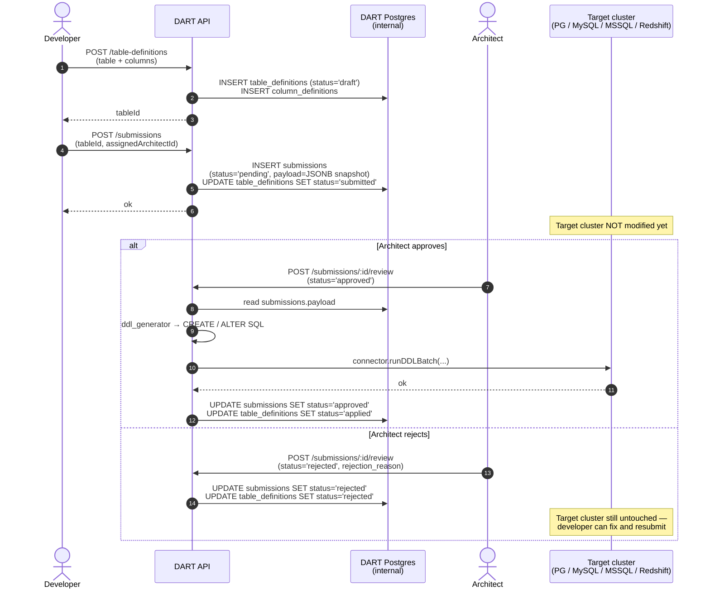

# DART — Data Architecture Review Tool

Full-stack platform where developers propose database table/column definitions and architects review/approve them. On approval, DART generates dialect-aware DDL and applies it to the target cluster (Postgres / MySQL / MSSQL / Redshift).

## Architecture

Monorepo with two workspaces:

```
backend/    Express 5 + TypeScript API; Postgres via pg; node-pg-migrate
frontend/   React 19 + React Router 7 + Tailwind; CRA build
render.yaml Defines the two Render services (dart-api, dart-frontend)
```

Request flow: React page → `useDashboard()` action → `api/*.ts` (Axios wrapper) → backend route → `authenticate` + role middleware → controller → model (raw SQL via pg) → response → frontend normalizes snake_case → context update → UI re-render.

**Roles:** `developer`, `architect`, `admin`, `viewer`. Developers create and submit; architects review their assigned queue; admins have unrestricted reach.

**Approval lifecycle:** developer drafts → submits with assigned architect → architect approves → backend builds DDL through `utils/ddl_generator.ts` and applies it via `services/connector.ts` → status moves to `applied`. Each column carries an `action` flag (`Add`/`Modify`/`Drop`/`No Change`) that drives ALTER vs CREATE behavior.

### Where data lives at each stage

Until the architect approves, **the target cluster is never touched**. Drafts and submissions live only in DART's own Postgres.



Tables involved on the DART side: `table_definitions`, `column_definitions`, and `submissions` (with the `payload` JSONB snapshot added in migration 5 so the architect always reviews exactly what was submitted, even if the developer edits the draft afterwards).

Key folders:

- `backend/src/{routes,controllers,models,middleware,services,utils}` — standard layered API
- `backend/src/services/connector.ts` — per-engine adapter (PG/MySQL/MSSQL/Redshift) with cached PG pools
- `backend/src/utils/ddl_generator.ts` — pure functions, dialect-aware CREATE/ALTER (covered by `ddl_generator.test.ts`)
- `backend/migrations/` — `node-pg-migrate` files; current state is migration 10
- `frontend/src/context/DashboardContext.tsx` — single source of truth for dashboard state, persisted to `localStorage` under `dart_dashboard_state`

## Dev setup

Requires Node 18.x and a running Postgres.

```bash
npm run install:all      # installs root, backend, and frontend deps
npm run dev              # starts backend on :5000 and frontend on :3000
```

The frontend dev server proxies `/api/*` to `http://localhost:5000` (see `frontend/package.json` `proxy`).

### Required environment variables (backend)

Place these in `backend/.env` for local dev or in the Render dashboard for prod. The process refuses to boot if any of the first three are missing.

| Var | Purpose |
|---|---|
| `DATABASE_URL` | Postgres connection string. In dev you may instead set `DB_HOST`/`DB_PORT`/`DB_NAME`/`DB_USER`/`DB_PASSWORD`. |
| `JWT_ACCESS_SECRET` | Signing key for short-lived (15 min) access tokens. **Required.** |
| `JWT_REFRESH_SECRET` | Signing key for refresh tokens (7 d, hash stored in DB). **Required.** |
| `ENCRYPTION_KEY` | Source material for the AES-256-CBC key that protects target-cluster passwords in `connections.password_encrypted`. **Required.** |
| `JWT_ACCESS_EXPIRY` | Override the 15m default if needed. |
| `JWT_REFRESH_EXPIRY` | Override the 7d default. |
| `NODE_ENV` | `production` strips `details` from error responses and tightens cookie flags. |

### Frontend env

- `REACT_APP_API_URL` — base URL of the API (omit `/api`; the client adds it).

## Migrations

```bash
cd backend
npm run migrate:up       # apply pending
npm run migrate:down     # revert one
npm run migrate:redo     # down + up (handy after editing the latest migration)
```

Files live in `backend/migrations/`, numbered sequentially. Migration 7 was reverted; current numbering jumps from 6 to 8.

## Tests

```bash
cd backend
npm test                 # Jest + ts-jest; covers ddl_generator, validation, auth routes
```

Test files live next to the code they cover (`*.test.ts`) plus `backend/src/__tests__/` for cross-cutting suites. Frontend currently has no tests beyond the CRA boilerplate.

## Deploy

Render reads `render.yaml`:

- `dart-api` runs `npm install && npm run build && npm run start` from `backend/`.
- `dart-frontend` builds CRA in `frontend/` and serves `build/` as a static site; `routes` rewrite hands every unknown path to `index.html` so React Router takes over.

Required env vars must be set in the Render dashboard before first boot — the API will exit if `JWT_*_SECRET` or `ENCRYPTION_KEY` is missing.

CORS allow-list lives in `backend/src/app.ts`; update it when introducing a new frontend host.
